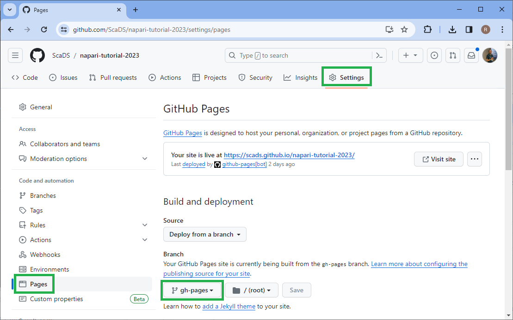

# Jupyter Book Template

This Jupyter Book template allows you to setup a Jupyter-Book with ScaDS.AI logo in just ten minutes.

## How to use this template 

> [!NOTE]
> Do NOT clone this repository. Using it as template works as explained below.

Install [cookiecutter](https://cookiecutter.readthedocs.io/en/stable/), git and [jupyer book](https://jupyterbook.org/en/stable/intro.html) using [mamba]():

```bash
mamba create --name book-creation-env python=3.10 git cookiecutter jupyter-book
```

You can then activate the environment:
```bash
mamba activate book-creation-env
```

Then, use the terminal to navigate to the directory where you want to create your new Jupyter Book and run the following command:

```bash
cookiecutter https://github.com/scads/jupyter-book-template
```

The programm will guide you through the process of creating your new Jupyter Book:

```bash
cookiecutter https://github.com/scads/jupyter-book-template
```

```
  [1/9] author_name (Scala Ble, Dataan Lytics and AI): Robert Haase
  [2/9] github_username (roberthaase): haesleinhuepf
  [3/9] email (email_for_imprint@uni-leipzig.de): robert.haase@uni-leipzig.de
  [4/9] book_name (My Book): first-book
  [5/9] book_slug (first_book):
  [6/9] book_short_description (Just another ScaDS.AI Jupyter Book about ...):
  [7/9] version ('0.1.0'):
  [8/9] open_source_license (CC BY 4.0):
  [9/9] Select include_ci
    1 - github
    2 - gitlab
    3 - no
    Choose from [1/2/3] (1):
```

The book is then created in your current directory. Navigate to the newly created folder:
```commandline
cd my_book
```

3. Install the Jupyter Book package requirements from the `requirements.txt` file (it is recommended to do this in a virtual environment, e.g., using [conda](https://docs.conda.io/en/latest/)):

```bash
# Optional steps to create and activate virtual environment
$ conda create --name mybook python=3.10 -y
$ conda activate mybook
```

```bash
$ cd my_book
$ pip install -r requirements.txt
```

4. Build the HTML render of your Jupyter Book:

```bash
$ jupyter-book build my_book/
```

5. View your rendered book in `_build/html/index.html`.

> [!WARNING]
> Never upload this `_build` directory to github. These are generated files and should not be versioned.

6. Make edits to your book by adding more content, updating the table of contents in `my_book/_toc.yml`, and and/or by editing the configuration file `my_book/_config.yml`. See the [Jupyter Book documentation](https://jupyterbook.org/intro.html) for more information on customizing your book.

7. `jupyter-book-template` optionally comes with CI workflow files to help easily deploy your book online. A CI workflow file would have been included in your directory structure if you chose `1 - github` or `2 - gitlab` for `Select include_ci_files:` in Step 2 above. For example, if you chose `1 - github`, when ready to deploy your book online:
   1. Make sure your book builds locally as expected (`jupyter-book build my_book/`) and that you have updated the `requirements.txt` file to include any additional packages required to build your book;
   2. Create a new public [GitHub repository](https://github.com/new) to host your book 
   3. Push your local book (including the `.github` hidden directory) to your GitHub repository.
   4. Activate GitHub Pages for your repository by going to the `Settings` tab of your repository and under the **GitHub Pages** heading, choose the `gh-pages branch` from the **Source** drop-down list. It may take a moment until the first book finished building. Sometimes, it is necessary to configure the `main` branch here until it ran through successfully and then modify it to the `gh-pages` branch.
      
   5. The GitHub Actions workflow provided with the cookiecutter (`my_book/.github/workflows/deploy.yml`) will automatically deploy your book to the `gh-pages` branch of your repository once pushed. It is typically available after a few minutes at `https://<user>.github.io/<myonlinebook>/`. You may need to go to the `Settings` tab of your repository and under the **GitHub Pages** heading, choose the `gh-pages branch` from the **Source** drop-down list. For alternative methods of deploying your book online, see the See the [Jupyter Book documentation](https://jupyterbook.org/intro.html).

   > Read more about GitHub Pages and Jupyter Book [here](https://jupyterbook.org/publish/gh-pages.html#automatically-host-your-book-with-github-actions), or using GitLab Pages [here](https://docs.gitlab.com/ee/user/project/pages/getting_started/pages_from_scratch.html).

## Contributing

If you have any questions or suggestions, please [open an issue](https://github.com/scads/jupyter-book-template/issues/new) on GitHub.

## Acknowledgements

This template is adapted from [cookiecutter-jupyter-book](https://github.com/executablebooks/cookiecutter-jupyter-book) which ws licensed BSD3 by Tomas Beuzen.
The original template was inspired and made possible by the [Cookiecutter project](https://github.com/cookiecutter/cookiecutter) and the [Jupyter Book project](https://github.com/executablebooks/jupyter-book).
